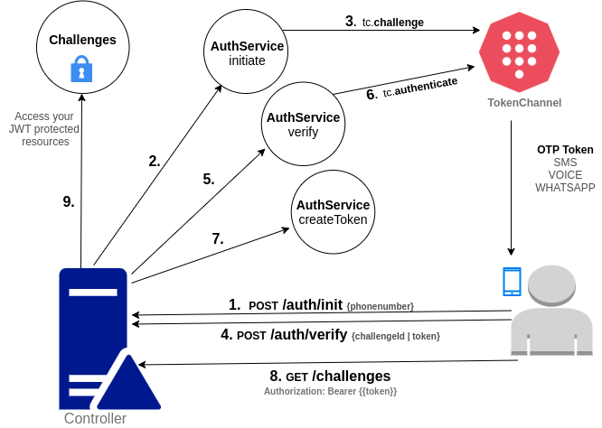

# Passwordless Authentication Flow in NestJs with TokenChannel

How to implement a passwordless approach for login.

> Nest (NestJS) is a framework for building efficient, scalable Node.js server-side applications. It uses progressive JavaScript, is built with and fully supports TypeScript (yet still enables developers to code in pure JavaScript) and combines elements of OOP (Object Oriented Programming), FP (Functional Programming), and FRP (Functional Reactive Programming). — https://docs.nestjs.com/



## How to run

```bash
git clone https://github.com/oalles/nestjs-passwordless-authentication-with-tokenchannel.git
cd nestjs-passwordless-authentication-with-tokenchannel
export TOKENCHANNEL_API_KEY=TCk-lLyLHZbyYnnM4WSNVGcq6NF0xvYtLFEJ1ZEn
yarn install
yarn build
yarn start
```
## Postman collections

#### TokenChannel Passwordless NestJs Playground
[](https://www.getpostman.com/collections/206419f392c07f8f9739)

####  TokenChannel Api Collection
[](https://www.getpostman.com/collections/6341f2799654255c9b1a)

## Links

[TokenChannel Node Documentation](https://tokenchannel.io/docs/node/)

[NestJs Documentation](https://docs.nestjs.com/)

[NestJs Authentication Documentation](https://docs.nestjs.com/security/authentication)

[Passport JWT strategy](http://www.passportjs.org/packages/passport-jwt/)    
